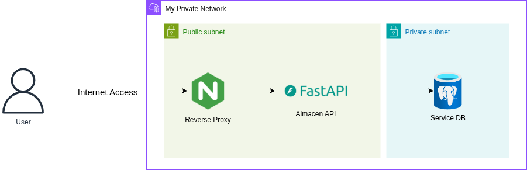

## Arquitectura

Esta arquitectura de microservicios se encuentra desplegada dentro de una red privada segmentada en una subred pública y otra privada. El acceso del usuario inicia desde Internet hacia un reverse proxy basado en Nginx, ubicado en la subred pública. Este proxy se encarga de recibir las solicitudes externas y redirigirlas a la API del backend desarrollada con FastAPI, que también se encuentra en la subred pública. FastAPI se encarga de procesar la lógica de negocio y actuar como intermediario entre el usuario y la base de datos.

La base de datos, implementada con PostgreSQL, está alojada en la subred privada, lo que asegura que no sea accesible directamente desde el exterior. Este diseño mejora la seguridad al restringir el acceso a los datos únicamente al backend autorizado, y al mismo tiempo permite escalar y mantener los componentes del sistema de forma independiente y eficiente.



Se ha optado por una arquitectura de microservicios para asegurar escalabilidad y despliegue independiente de componentes clave como el API de Almacén.
El uso de un reverse proxy permite enrutar tráfico de forma eficiente y segura hacia servicios internos. La base de datos está en una subred privada, aislada del acceso público, cumpliendo requisitos de seguridad.
Esta segmentación también facilita el cumplimiento de normativas. El patrón de separación entre red pública y privada protege servicios críticos.
 La exposición del API permite la integración con otros sistemas. La arquitectura elegida responde a necesidades de disponibilidad, modularidad y protección de datos.

## Pasos para Configurar el Proyecto

1. **Instalar uv:**
   Sigue las instrucciones en la [Guía de Instalación de uv](https://docs.astral.sh/uv/getting-started/installation/)

2. **Instalar Dependencias:**

   ```sh
   uv sync
   ```

   **Nota**: Antes de ejecutar este comando, debes tener tu entorno virtual activado.

3. **Instalar Dependencias de Desarrollo:**

   ```sh
   uv sync --dev
   ```

4. **Ejecutar tu script de Python:**

   ```sh
   uv run your_script.py
   ```

5. **Ejecutar la arquitectura completa:**

   ```sh
   docker compose up -d
   ```
